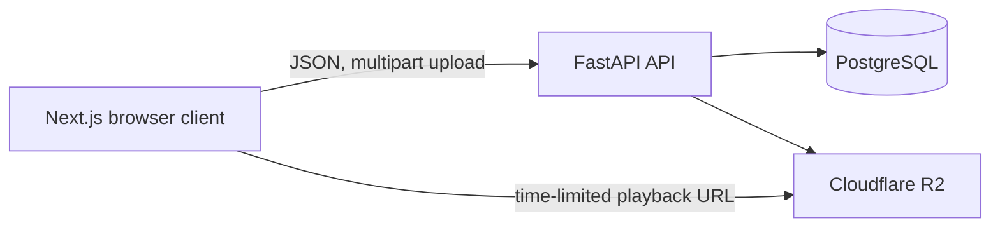
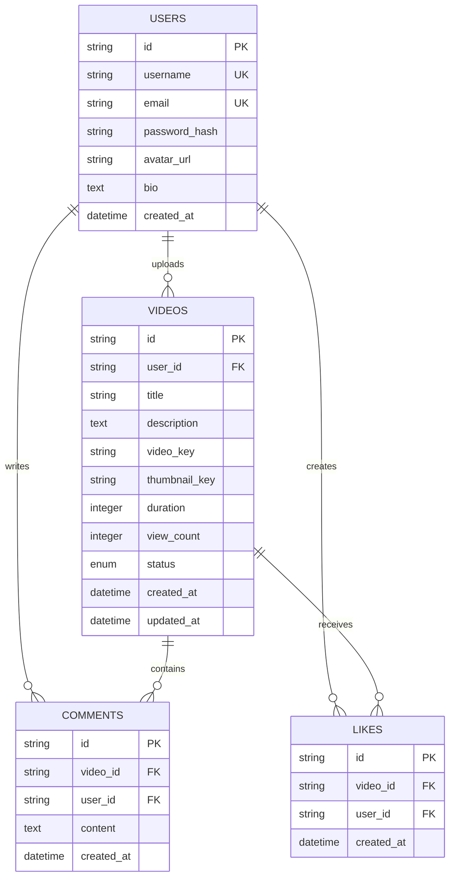

# TubeLite System Blueprint

## Scope

TubeLite is a Version 1 video-sharing application. Guests can browse, search,
and watch videos. Registered users can manage their profile and videos, post
and delete their own comments, and toggle likes.

Out of scope for Version 1: playlists, subscriptions, notifications, Shorts,
live streaming, recommendations, advertising, monetization, and copyright
detection.

## Architecture

The API owns authentication, authorization, validation, metadata, pagination,
and presigned R2 URL creation. R2 stores video and thumbnail objects; the
database stores object keys rather than permanent file URLs.

## Request Flows

### Authentication

1. The client posts signup or login credentials to `/api/auth`.
2. The API hashes or verifies the password and signs a JWT containing the user ID.
3. The API returns the public user profile and writes the JWT to an httpOnly
   `access_token` cookie.
4. Protected endpoints resolve that cookie to the current user before work begins.

### Upload and Playback

1. An authenticated user submits title, description, video, and optional thumbnail.
2. The API validates MIME type and size, then uploads objects to R2 under
   user-scoped keys.
3. The API persists video metadata in PostgreSQL.
4. A visitor requests video metadata, which increments the view count.
5. The visitor requests `/stream`; the API returns a one-hour R2 URL for the
   HTML video element.

## Data Model

The `likes(video_id, user_id)` unique constraint permits at most one like per
user and video. Deleting a user or video cascades to related videos, comments,
and likes.

## API Surface

| Module | Base path | Responsibility |
| --- | --- | --- |
| Auth | `/api/auth` | Signup, login, logout, current user |
| Videos | `/api/videos` | Feed, search, upload, playback, edit, delete |
| Users | `/api/users` | Public channel, owned uploads, profile updates |
| Comments | `/api/videos/{video_id}/comments`, `/api/comments` | List, create, delete own comment |
| Likes | `/api/videos/{video_id}/like` | Like status, toggle like |

## Delivery Status

| MVP capability | Status |
| --- | --- |
| Authentication | Complete |
| Video upload, watch, edit, delete | Complete |
| Thumbnail upload and display | Complete |
| Homepage feed and pagination | Complete |
| Title search and pagination | Complete |
| View counting | Complete |
| Comments | Complete |
| Channel/profile | Complete |
| Likes | Complete |
| Next.js frontend | Not started |
